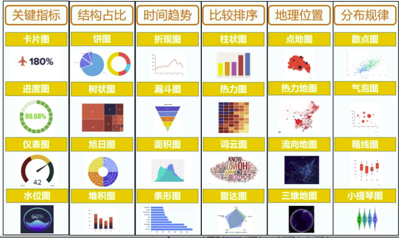
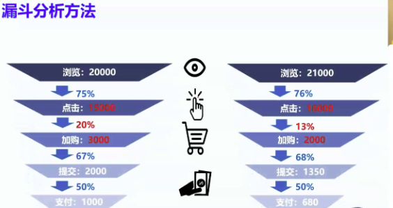

# DataAnalysis-Excel 数据分析

## 1、三天训练营内容

### DAY1-实操搞定职场汇报

#### 数据透视-快速处理数据

#### 数据可视化-看清业务问题

#### 数据分析思维-业务分析思路

### DAY2-商业数据分析思维

#### 数据分析实战思路-万能三步走

#### 技能+思维的业务应用

- APP 数据移动分析实践
- 进阶分析方法实战应用

#### 利用工具高效办公-PYTHON 入门实操

### DAY3-深入问题数据洞察

#### 深入分析业务洞察

- 业务优化实战项目
- 真实项目实操沉浸式演练
- 用分析方法做业务预估汇报

## 2、高级图表=数据透视+数据可视化+数据联动

### 1）数据透视-选取有效信息

- 业务流程：
  - 求职者 => 1. 明确求职目标 => 2.筛选岗位 => 3.投递简历

- 分析维度 1：行业
- 分析维度 2：城市
- 分析维度 3：工作年限
- 分析维度 4：公司规模

- 问题 -> 1. 分析维度 -> 2. 收集数据
- 按行业：岗位数量+平均薪水
  - 行业（按行业分组）
  - 公司简称（计数，岗位数量）
  - 薪水（平均薪水）
  - 分组汇总：Excel 透视表
- 数据透视：从 4 个维度分析数据
- 数据可视化：把分类的数据做成图表

#### 分析 1：每个行业、岗位数量、平均薪水

- 插入透视表
  1. 选择全部数据这个 sheet
  2. 鼠标在任意单元格上点击下
  3. 点击“插入”
  4. 选择“数据透视表”
- 设置透视表
  1. 把“行业”拖入“行”
  2. 把“公司简称” “薪水” 列拖到 “值”
  3. 双击“行业”，修改列名为“行业”
  4. 双击“计数项：公司简称”，修改为 “岗位数量”
- 设置平均薪水
  1. 修改“求和项：薪水”为“平均薪水”
  2. 选择为平均值

#### 分析 2：每个城市、岗位数量、平均薪水

- 复制上表，另起一行，粘贴表格
- 把“行业”隐藏，把“城市”拖入“行”

#### 分析 3：每个工作年限的岗位数量、平均薪水

- 复制上表，另起一行，粘贴表格
- 把“城市”和“岗位数量”隐藏，把“工作年限要求”拖入“行”
- “工作年限要求”修改为“工作年限”

#### 分析 4：不同公司规模的岗位数量

- 复制上表，另起一行，粘贴表格
- “行”选择“公司规模”
- “值”选择“公司简称”
- “公司简称”修改为“岗位数量”

### 2）数据可视化-丰富多样的数据图表

#### （1）数据条

1. 点击序号“B”可以把这一列全部选中
2. 点击“开始”
3. 点击“条件格式”
4. 点击“数据条”
5. 选择第一个选项

#### （2）组合图

- 选择分析 2（城市透视表）
- 点击“插入”
- 选择“推荐的图表”
- 选择“组合图”
- 选择第二个列（平均水）为“次选坐标轴”
- 对其他除“公司规模”图表外设置组合图
- 对“公司规模”图表设置圆圈图：选择“饼图”最后一个空心圆圈

#### （3）数据联动-让你的图表动起来

1. 新建一个 sheet，用以存放报表结果
2. 重命名为“报表”
3. 复制四个图表到“报表”，位置暂时自行排列

#### 切片器

1. 点击“城市”透视表任意单元格，表示告诉 Excel：我要选择这个透视表进行操作了
2. 点击“插入”
3. 点击“切片器”，选择“城市”
4. 把生成的切片器复制粘贴到“报表”

#### 报表连接

1. 选中切片器
2. 选中“报表连接”
3. 勾选所有 4 个透视表

## 3、图表选择

<!-- -  -->
- 

## 4、数据看板

- 为什么要数据看板？
  - 掌握情况
  - 解决问题
  - 汇报工作
- 数据看板构成两大要素
  - 数据监控
  - 异常分析
- 不会数据分析人思维模式
  - 我觉得，我认为
- 会数据分析人思维模式
  - 通过数据发现
- 多维度拆解分析方法
  - 辛普森悖论：在有些情况，考察数据整体和考察数据不同部分，会得到相反的结论
  - 多维度拆解分析方法优点
    - 有效防止辛普森悖论
    - 保证你的分析结论是正确的
- 漏斗分析方法
  - 
  - 作用：
    - 定位问题业务环节
    - 预估（倒推）

## 5、数据分析学习图谱

### 1）数据分析工具

- Excel 数据分析
- Power BI 搭建商业智能报表
- SQL 快速处理数据
- PYTHON数据分析
- 描述和推断统计

### 2）数据分析思维与方法

- 10 大数据分析方法
- 指标体系搭建
- 数据分析报告

### 3）大厂实战项目

- 淘宝：电商行业用户行为分析
- 京东：自媒体投放分析
- Bilibili：指标体系分析
- 滴滴出行：报表解读