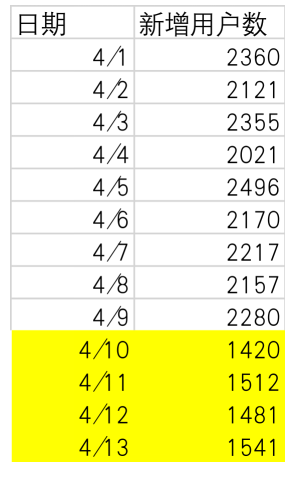

# 数据分析万能三步走

## 1、案例背景

- 假设公司产品（一款本地服务类 app），近期发现新增用户数明显下滑。老板要求你分析：数据异动的原因是什么？
- 最开始你只有“问题”sheet 中的数据。其他数据是随着分析深入，和业务部门沟通获取的。
- 
  
## 2、项目思路

- 用数据分析三步走展开分析：
  1. 依次进行：明确问题、分析原因、提出建议这三个步骤
  2. 需要确定：每个步骤包含哪些内容？运用什么分析方法？
  3. 根据分析结果给出业务建议。
- 明确问题
  - 
  1. 明确数据来源和准确性
     1. 时间为：4.1-4.13 日，其中 10-13 日数据异常
     2. 地点和数据来源：通过产品后台数据确认，并核实准确性
     3. 

### 指标理解

#### 指标理解 1：和谁比下降了？（自身环比数据+同比数据）

1. 环比数据（制作折线图）——
   1. 选择“问题”sheet
   2. 选中任意数据
   3. 点击“插入”
   4. 分析时间变化，选择图表-折线图
   5. 选择纵坐标轴
   6. 设置坐标轴格式，可设置边界最小值为 1000，凸显数据变化
2. 同比数据（制作折线图）——
   1. 为了确认数据是否为周期性波动，需要从产品部门获取更多日期的新增用户数据：包含 4 月 1 日之前的数据；以及去年同期数据。
   2. 
   3. 制作折线图
      1. 选择“拉长数据维度-周期性”sheet
      2. 点击“插入”
      3. 分析随时间变化及同比情况，选择图表-折线图
3. 结论：从折线图看出，2022 年（蓝色折线）3/10-4/9 新增用户数平稳，4/10 开始才明显下滑；并且 2021 年曲线整体平稳，没有周期性下降。 
因此确定：2022 年 4/10-4/13 的数据存在异常，需要进一步分析原因。

#### 指标理解 2：指标含义

- 和业务人员沟通确认，“新增用户数”指标的定义
  - 性别：新增男性用户数+女性用户数
  - 年龄：新增 15 岁用户/16 岁/17 岁...
  - 城市：新增城市 1 + 城市 2+ 城市 3...的新增用户数
  - 渠道：渠道 1+渠道 2 + 渠道 3+...的新增用户数
- 将以上分析结论，填入步骤“明确问题”中：

## 3、明确问题

1. 数据准确性：4 月 10-13 日产品服务地区新增用户数出现明显下滑
2. 指标理解：新增用户数=性别、年龄、城市、渠道来源

## 4、分析原因

- 万能三步走的第二步，分析原因。哪里出了问题？是什么导致新增用户数下降的？
- 分析原因阶段，常见的分析方法包括：多维度拆解分析方法、假设检验分析方法。（使用“多维度拆解分析方法”对问题进行拆解，将一个复杂问题细化成各个子问题；再对拆解的每个部分，使用“假设检验”找到哪里出现了问题。）
- 分析原因
  - 哪里出了问题？
  - 是什么导致新增用户数下降的？
    - 多维度拆解分析方法
    - 假设检验分析方法

### 1）分析思路

- 前面已经拆解了新增用户数指标，从性别、年龄、城市和渠道维度拆解
- 再假设检验分析方法，分别假设：是性别原因、年龄原因、城市原因和渠道原因，导致新增用户数下降。
- 思路图
  - 

### 2）补充数据和清洗

- 由于以上假设维度的分析需要数据支持，因此和业务部门沟通需求后，补充了具体的新增用户数据，包括日期、ID、性别、年龄、城市和渠道字段。
- 
- 城市列数据太过繁杂，通过数据清洗，只需保留具体城市名称
  1. 选择城市整列
  2. 点击“开始”
  3. 点击“查找和替换”
  4. 点击“替换”
  5. 查找内容填写-“首次登陆：广东”
  6. 替换为-保持空值
  7. 点击全部替换

### 3）展开具体分析

#### （1）假设是性别原因导致新增用户数下降

- 需要收集数据下降后（4 月 10 之前和之后）的性别比例数据，进行论证。
- 
- 由于数据较多，插入数据透视表方便数据的汇总和分析
  1. 创建数据透视表
     1. 选择任意数据单元格
     2. 点击“插入”
     3. 选择“数据透视表”-“表格和区域”
     4. “行”选择“性别”； “列”选择日期（由于需要看具体日期的数值变化，因此列只保留日期，删除月）； “值”选择“ID”（需要看各日期下，男女用户数目，值设置为计数）；
  2. 值字段设置
     1. 点击“值”中“ID”最右边的小箭头，选择“值字段设置”
     2. 选择“计数”
  3. 组合
     1. 取消组合：选中 3 月 10 日-4 月 9 日所有的日期单元格   右键-取消组合（日期当前状态是各自为组）
     2. 继续选中 3/10-4/9，右键选择“组合”
     3. 选择剩下的日期 4/10-4/13，继续右键选择“组合”
     4. 选择数据组 1，修改命名为 3/10-4/9
     5. 选择数据组 2，修改命名为 4/10-4/13
     6. 已经有了组合后的“日期 2”，删除列里的“日期”字段
  4. 列汇总的百分比
     1. 点击任意数值单元格
     2. 右键-选择“值显示方式”
     3. 由于两个组数据差别大，因此选择“列汇总的百分比”
  5. 生成图表
     1. 点击任意数值单元格
     2. 点击“插入”
     3. 点击“饼图”
     4. 由于有两个日期分组，选择圆环图
  6. 图表设置
     1. 右键日期，点击“隐藏图表上所有字段按钮”
     2. 选中圆环，右键-选择“添加数据标签”
     3. 选中数据标签（外圈操作步骤一致）
     4. 右键-选择“设置数据标签格式”
     5. 勾选系列名称、类别名称、百分比，取消勾选“值”
     6. 选择数字中的类别选择“百分比”
  7. 
- 结论：从圆环图中看出，两个日期阶段男女比例没有明显变化，都是 50% 左右。因此假设 1 不成立。

#### （2）假设是年龄原因导致新增用户数下降

- 需要收集数据下降后（4 月 10 之前和之后）的年龄比例数据，进行论证。
- 
- 创建数据透视表
  1. 创建
     1. 复制已经做好的透视表，粘贴到下方
     2. 取消勾选行中的“性别”，将“年龄”拖入行
  2. 格式化“15 及以下”单元格
     1. 选中“15 及以下”单元格
     2. 右键-“移动”
     3. 将“15 及以下”移至开头（因为是最小的年龄段）
  3. 生成折线图
     1. 选择任意数据单元格
     2. 选择折线图的第一个
  4. 
- 结论：
  - 从折线图对比看出，4/10-4/13 的组别中，23 及以下的新增用户占比明显更少。因此假设 2 成立，23 及以下年龄段出现数据异常。

#### （3）假设是城市原因导致新增用户数下降

- 需要收集数据下降后（4 月 10 之前和之后）的城市比例数据，进行论证。
- 
- 图表分析
  1. 创建数据透视表
     1. 复制已经做好的透视表，粘贴到下方
     2. 取消勾选行中的“性别”，将“城市”拖入行
  2. 生成雷达图
     1. 选择任意数据单元格
     2. 选择折雷达图的第一个
  3. 
- 结论：
  - 从雷达图对比看出，两个日期阶段新增用户比例基本相同。因此假设 3 不成立。

#### （4）假设是渠道原因导致新增用户数下降

- 需要收集数据下降后（4 月 10 之前和之后）的渠道比例数据，进行论证。
- 
- 图表分析
  1. 创建数据透视表
     1. 复制已经做好的透视表，粘贴到下方
     2. 取消勾选行中的“性别”，将“渠道”拖入行
  2. 生成雷达图
     1. 选择任意数据单元格
     2. 选择折雷达图的第一个
  3. 
- 结论：
  - 从雷达图对比看出，4/10-4/13 的组别中，抖音推广页的新增用户占比明显更少。因此假设 4 成立，抖音推广页出现了问题。

### 总结四个假设分析的结论

- 

#### 补充假设-漏斗分析方法：从业务流程出发防止遗漏问题

- 用户成为新增用户前，要经历渠道曝光-点击-下载-注册的漏斗阶段。因此需要补充分析，是否某个漏斗阶段出现了问题，导致新增用户减少。
- 
- 和业务部门沟通获取 3/10-4/13 的用户点击率、下载率和注册率数据
- 
- 图表分析
  1. 创建数据透视表
     1. 选中任意数据单元格
     2. 点击“插入”
     3. 图表-折线图-二维折线图第一个
  2. 解决注册率曲线过低的问题
     1. 选择“注册率”曲线
     2. 右键-设置数据系列格式
     3. 由于注册率数组和点击率相差太大，因此勾选为：次坐标轴
  3. 以同样的方法设置“下载率”曲线
- 结论
  - 从折线图对比看出，4/10-4/13 只有注册率曲线出现明显低谷。因此补充假设成立，注册率明显下滑。

### 总结

- 将以上 5 个假设检验的分析结果，填入“分析原因”步骤中
- 

## 5、提出建议

- 针对排查出的问题，分别提出业务建议和后续解决方向
- 